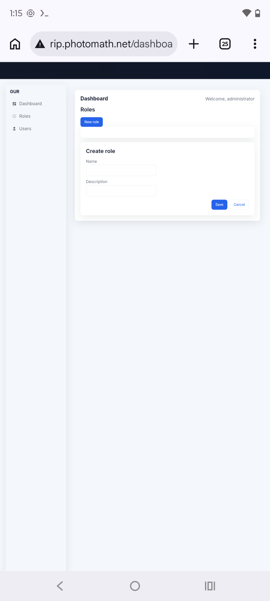

# Anatomy of an Exposed IAM Frontend

### Unauthenticated admin access on a Google acquisition asset — and an honest look at its severity


> **TL;DR** — I found an administrative IAM interface exposed on the public internet on a Google-acquisition subdomain. The login accepted default credentials (and, on closer inspection, *any* password), and the API behind it answered unauthenticated requests. Google's product team triaged it **P2/S2** and shipped a fix in ~9 days. The reward panel awarded **credit, not cash** — and this writeup explains, honestly, why that was the right call. The judgment behind that decision is the real lesson.

---

## Contents

- [Why I'm writing this](#why-im-writing-this)
- [1. Discovery](#1-discovery)
- [2. The authentication weakness](#2-the-authentication-weakness)
- [3. The API layer behind it](#3-the-api-layer-behind-it)
- [4. Remediation](#4-remediation)
- [5. The honest part: why this was correctly *not* rewarded](#5-the-honest-part-why-this-was-correctly-not-rewarded)
- [6. Lessons I'm carrying forward](#6-lessons-im-carrying-forward)
- [Timeline](#timeline)

---

## Why I'm writing this

Most bug-bounty writeups stop at "I found X, here's the payout." I think the more useful story is often the gap between *how severe a finding looks* and *how severe it actually is* — because judging that gap correctly is the real skill, both in triage and on a security team.

This is a finding that looked critical on the surface: an unauthenticated, administrative Identity-and-Access-Management (IAM) interface exposed on the public internet, on a domain belonging to a Google acquisition. Google's product team agreed it was worth fixing (P2/S2) and shipped remediation quickly. The VRP reward panel, separately, decided it did **not** merit a monetary reward — and after working through the evidence, I think their reasoning was correct.

So this writeup does two things: it breaks down the technical anatomy of the exposure, and it explains — honestly — why the reward decision was the right one. The second half is the part I'd want a hiring manager to read.

---

## 1. Discovery

The asset was `rip.photomath.net`, a subdomain tied to a Google acquisition (Photomath). Initial fingerprinting surfaced several signals worth noting:

| Observation | How it was determined | Why it matters |
|---|---|---|
| Served an admin UI ("GestionUsersRolesFrontend") | Direct browser load | A privileged users/roles management surface |
| Plain HTTP only; TLS failed on `:443` | `unexpected eof` on HTTPS handshake | Cleartext transport for any session material (CWE-319) |
| Fronted by Google infrastructure | `Via: 1.1 google` header; GCP IP on resolution | Confirms routing through Google's edge, not a random host |

A users/roles admin panel reachable over plain HTTP, with no SSO/BeyondCorp in front of it, is exactly the kind of surface worth examining closely.

## 2. The authentication weakness

The login screen ("Bienvenue administrateur") accepted the textbook default pair:

```
email:    admin@photomath.net
password: admin
```

That alone is **CWE-1188 (default credentials)**. But testing further revealed something more fundamental: the portal accepted *any arbitrary password string* for the admin account. That moves it from "weak credentials" to **CWE-287 (broken authentication)** — the frontend performed no meaningful credential validation against the backend. The login was effectively decorative.

## 3. The API layer behind it

Surface-level UI bypasses are weaker findings when the backend still enforces authorization. So the next question was: does the API behind this UI independently check auth? It did not.

```http
GET /api/roles HTTP/1.1
Host: rip.photomath.net
# no auth headers, no session cookie

HTTP/1.1 200 OK
[]
```

An unauthenticated `GET` returned a valid (empty) JSON array rather than a `401`/`403`. An `OPTIONS` probe advertised `GET, POST, HEAD`, indicating the endpoint was designed to accept writes as well as reads. Whitelabel error pages identified the backend as **Java Spring Boot**.

So the exposure wasn't just a login bypass — the data layer itself answered unauthenticated requests. That's the architecturally interesting part: two independent controls (frontend authentication, backend authorization) were both absent or non-functional on the same surface.



*The admin dashboard after login, reached without valid credentials. Note the empty "Create role" form (write surface) and the absence of any real user data — consistent with a non-production/sandbox instance.*

> **Scope of testing.** I confirmed *read* reachability and the *advertised* method set. I did **not** issue writes, create roles, or modify any state. Demonstrating reachability was sufficient, and stopping there is what safe-harbor expectations require.

## 4. Remediation

Google's handling was fast and clean:

- Accepted within ~24 hours and filed to the product team.
- Marked **Fixed** about nine days later — the endpoint was decommissioned and the hostname began returning `NXDOMAIN`.
- Triaged internally as **P2 / S2**.

---

## 5. The honest part: why this was correctly *not* rewarded

It's easy to write "unauthenticated admin access + broken auth + exposed write API on a Tier-1 Google asset" and call it critical. I framed it strongly in my original report. But severity is a function of **realized impact on systems and data that actually matter**, and three things cut against the dramatic reading:

**a) The instance was almost certainly non-production.**
The UI carried developer placeholder text ("users works!"), and `/api/roles` returned an empty set (`[]`). There was no evidence of real users, credentials, or sensitive records behind it. An exposed admin panel over an empty sandbox is a real hygiene problem — but it is not a data breach.

**b) The root cause was infrastructure hygiene, not an application vulnerability.**
The fix was decommissioning a stale/dangling endpoint, not patching application logic. The reward panel's rationale was precise: the issue resulted from stale DNS records and did not affect a system under Google's *direct operational control*. VRP rewards target vulnerabilities *in Google's applications*, not orphaned artifacts that happen to resolve through their edge.

**c) My strongest "impact" claim was speculative.**
In my appeal I leaned on brand/phishing potential ("an attacker could host a convincing portal here"). That's a hypothetical secondary impact, not demonstrated harm — and on reflection, not the kind of concrete, exploitable risk a reward is meant to recognize.

I appealed the credit-only decision; the panel reconsidered and upheld it. In hindsight, my appeal restated the impact in stronger *words* rather than presenting new *evidence* — which is exactly why it shouldn't have (and didn't) change the outcome.

### The key mental model: severity track != reward track

The single most useful thing I took away:

> A **P2/S2 "Fixed"** is an engineering signal that the team cared enough to remediate. It is **not** a reward signal. The product team optimizes for *"should this be cleaned up?"* The reward panel optimizes for *"did this expose real risk in a system we operate?"* Those questions have different answers, and conflating them is a common rookie mistake — one I made.

---

## 6. Lessons I'm carrying forward

- **Prove impact; don't infer it from labels.** "Tier 1" describes a domain's *potential* sensitivity, not the severity of any given finding on it. The data actually at risk is what counts.
- **Distinguish hygiene from vulnerability.** Dangling DNS, sandbox exposure, and stale endpoints are frequently valid-but-credit-only. Knowing this *before* writing the report sets honest expectations.
- **Two-layer reasoning beats one-layer.** Checking whether the *backend* independently enforced auth — not just the login form — is what made this a more complete finding. Always ask what the next control down is doing.
- **Appeals need evidence, not adjectives.** If I can't add a new, concrete fact, escalating the language only erodes credibility with triagers.
- **Calibration is the skill.** Anyone can find something that *looks* alarming. The professional move is accurately stating how much it matters — including when the answer is "less than it first appeared."

---

## Timeline

| Date | Event |
|---|---|
| Day 0 | Reported to Google VRP |
| Day 0 | Automated acknowledgement |
| ~Day 1 | Accepted; bug filed to product team |
| ~Day 10 | Marked **Fixed** (endpoint decommissioned, `NXDOMAIN`) |
| ~Day 24 | Reward panel: credit-only |
| ~Day 28 | Appeal reviewed and upheld; credit confirmed |

---

<sub>Reported through the Google Bug Hunters program. The affected endpoint was remediated and decommissioned (`NXDOMAIN`) by Google prior to publication. No data was accessed or modified beyond what was strictly necessary to confirm the exposure. This writeup reflects my own analysis and is not affiliated with or endorsed by Google.</sub>
