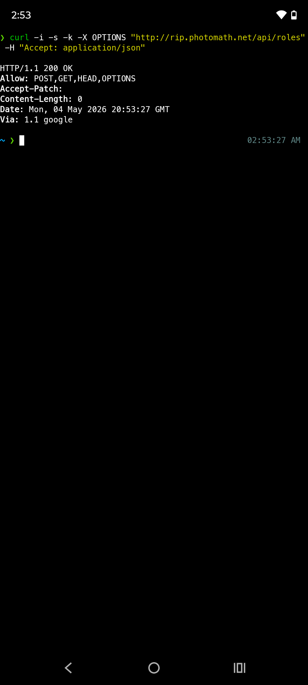
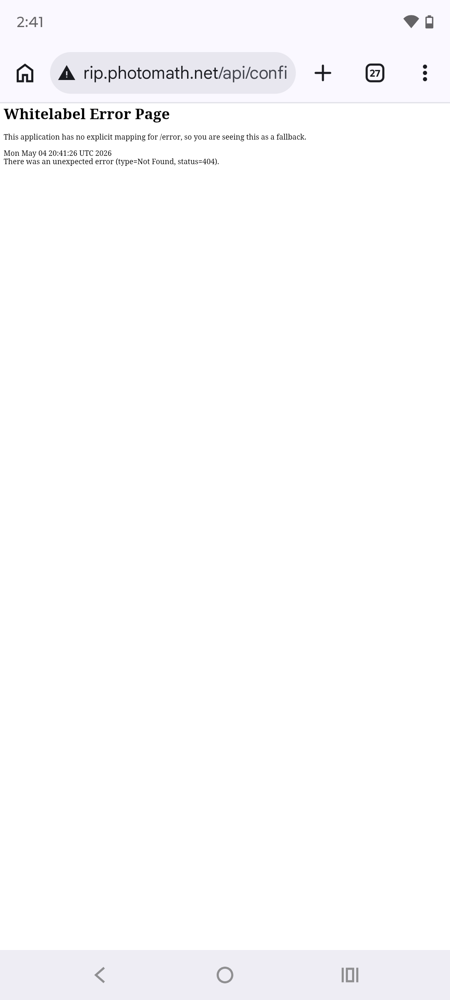
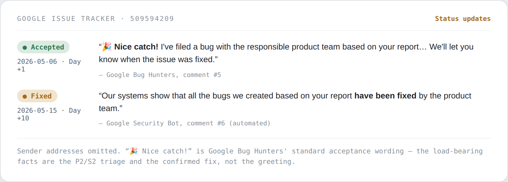
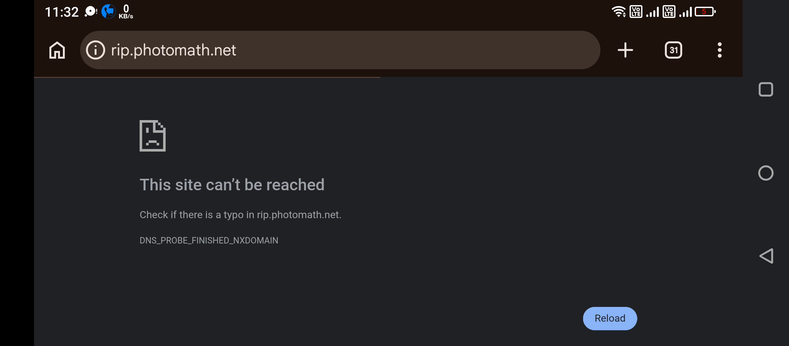

# Anatomie d'un frontend IAM exposé

**Un contournement total de l'authentification sur un actif issu d'une acquisition de Google — et un compte rendu précis des raisons pour lesquelles il a été corrigé en neuf jours, et pour lesquelles le récompenser par 0 $ était la bonne décision.**

**🌐 Read this in your language:** [English](../2026-05-exposed-iam-frontend-google-vrp.md) · [Español](./2026-05-exposed-iam-frontend-google-vrp.es.md) · **Français** · [Deutsch](./2026-05-exposed-iam-frontend-google-vrp.de.md) · [العربية](./2026-05-exposed-iam-frontend-google-vrp.ar.md) · [हिन्दी](./2026-05-exposed-iam-frontend-google-vrp.hi.md) · [বাংলা](./2026-05-exposed-iam-frontend-google-vrp.bn.md) · [简体中文](./2026-05-exposed-iam-frontend-google-vrp.zh.md) · [日本語](./2026-05-exposed-iam-frontend-google-vrp.ja.md)


> **CWE :** [CWE-287](https://cwe.mitre.org/data/definitions/287.html) (Authentification incorrecte) · [CWE-1188](https://cwe.mitre.org/data/definitions/1188.html) (Utilisation d'identifiants par défaut) · [CWE-319](https://cwe.mitre.org/data/definitions/319.html) (Transmission en clair)
> **Type d'actif :** acquisition de Google (Photomath), Niveau 1 selon `external_domains_acquisitions.asciipb`

**TL;DR** — Une interface d'administration IAM était exposée sur l'internet public, sur un sous-domaine issu d'une acquisition de Google. La connexion acceptait les identifiants par défaut, puis acceptait *n'importe quel* mot de passe, et l'API située derrière répondait aux requêtes non authentifiées — une défaillance complète de la couche d'authentification. L'équipe produit de Google l'a classé P2/S2 et l'a démantelé neuf jours après avoir accepté le rapport. Le comité de récompenses du VRP a, séparément, accordé un crédit et aucune somme. Cet article décompose l'exposition, puis fait la chose la plus difficile et la plus utile : il explique, au niveau du mécanisme, **pourquoi ces deux décisions sont toutes deux correctes et ne se contredisent pas** — et quelles preuves l'auraient fait franchir le seuil de récompense. Calibrer cet écart est la véritable compétence.

---

## Sommaire
- [Pourquoi j'écris ceci](#pourquoi-jécris-ceci)
- [1. Découverte — et comment trouver cette classe à dessein](#1-découverte--et-comment-trouver-cette-classe-à-dessein)
- [2. La faiblesse d'authentification](#2-la-faiblesse-dauthentification)
- [3. La couche d'API derrière](#3-la-couche-dapi-derrière)
- [4. Remédiation](#4-remédiation)
- [5. Cause racine, précisément : servi par l'edge ≠ exploité par Google](#5-cause-racine-précisément--servi-par-ledge--exploité-par-google)
- [6. Pourquoi cela n'a, à juste titre, pas été récompensé — et ce qui l'aurait changé](#6-pourquoi-cela-na-à-juste-titre-pas-été-récompensé--et-ce-qui-laurait-changé)
- [7. Si je défendais ceci](#7-si-je-défendais-ceci)
- [8. Leçons que je retiens](#8-leçons-que-je-retiens)
- [Ce que ce signalement démontre](#ce-que-ce-signalement-démontre)
- [Chronologie](#chronologie)
- [Références](#références)

## Pourquoi j'écris ceci

La plupart des writeups de bug bounty s'arrêtent à « j'ai trouvé X, voici la prime ». L'histoire la plus utile est souvent l'écart entre la gravité qu'un signalement *semble* avoir et celle qu'il *a* réellement — car juger cet écart correctement est le vrai travail, des deux côtés d'une file de triage comme dans toute équipe de sécurité.

Ce signalement paraissait critique en surface : une interface d'administration de gestion des identités et des accès (IAM) non authentifiée, exposée sur l'internet public, sur un domaine appartenant à une acquisition de Google. L'équipe produit de Google a convenu que cela valait la peine d'être corrigé (P2/S2) et l'a remédié vite. Le comité de récompenses du VRP a décidé, séparément, que cela ne méritait pas de récompense monétaire — et après avoir travaillé les preuves, je pense que leur raisonnement était exactement juste.

Cet article fait donc deux choses : il dissèque l'anatomie technique, et il explique — honnêtement, et au niveau du *pourquoi les systèmes se sont comportés ainsi* — pourquoi « corriger vite » et « ne rien payer » étaient toutes deux les bonnes décisions. La seconde moitié est la partie que je voudrais qu'un recruteur lise.

## 1. Découverte — et comment trouver cette classe à dessein

L'actif était `rip.photomath.net`, un sous-domaine lié à une acquisition de Google (Photomath). Il n'est pas apparu par chance ; il est issu d'une méthode reproductible visant le recoin le plus rentable d'un périmètre vaste et riche en acquisitions — **une infrastructure obsolète et non migrée d'entreprises récemment acquises** :

1. **Énumérez le périmètre des acquisitions, pas seulement le produit phare.** Le fichier de périmètre de Google lui-même, `external_domains_acquisitions.asciipb`, classe les domaines d'acquisitions par niveau. `*.photomath.net` y figure, au Niveau 1. Les sous-domaines d'acquisitions sont là où réside la dette d'intégration.
2. **Expansion passive des sous-domaines** (journaux de transparence des certificats + DNS historique) révèle des hôtes comme `rip.` qui n'apparaissent jamais dans la navigation du produit.
3. **Résolvez et prenez l'empreinte de chaque hôte**, puis filtrez sévèrement selon les indices d'infrastructure non migrée plutôt que de production durcie :

| Observation | Comment cela a été déterminé | Pourquoi c'est important |
|---|---|---|
| Servait une UI d'administration (`GestionUsersRolesFrontend`) | Chargement direct dans le navigateur | Une surface privilégiée de gestion utilisateurs/rôles |
| **HTTP simple uniquement ; TLS a échoué sur `:443`** | `unexpected eof` sur le handshake HTTPS | Un hôte hors de la politique standard de terminaison TLS de l'acquéreur — un indice de migration (CWE-319) |
| **Servi par l'infrastructure de Google** | En-tête `Via: 1.1 google` ; IP GCP à la résolution | Achemine via l'edge de Google — mais, comme le montre la Section 5, servi par l'edge n'est **pas** la même chose qu'exploité par Google |
| Chaînes d'administration non anglaises (`Bienvenue administrateur`), texte indicatif (`users works!`) | Inspection de l'UI | Build de l'entreprise d'origine, probablement dev/bac à sable, repris tel quel dans l'acquisition |

Le motif qui devrait faire s'arrêter un chasseur expérimenté : **un panneau d'administration utilisateurs/rôles, accessible en HTTP simple, sans SSO / proxy sensible à l'identité devant lui, sur un domaine de niveau acquisition.** Chacun de ces adjectifs est un symptôme d'une infrastructure héritée et jamais intégrée au périmètre de sécurité de l'acquéreur.

## 2. La faiblesse d'authentification

L'écran de connexion (`Bienvenue administrateur`) acceptait la paire par défaut classique :

```
email:    admin@photomath.net
password: admin
```

Cela seul relève du CWE-1188 (identifiants par défaut). Mais en creusant, quelque chose de plus fondamental est apparu : le portail acceptait *n'importe quelle* chaîne de mot de passe arbitraire pour le compte administrateur. Cela le fait passer d'« identifiants faibles » à **CWE-287 (authentification cassée)** — le frontend n'effectuait aucune validation réelle des identifiants contre un backend. La connexion était décorative.

Je l'ai confirmé délibérément (connexion avec des caractères aléatoires) plutôt que de le supposer, parce que « les identifiants par défaut fonctionnent » et « l'authentification est totalement absente » sont des gravités différentes et je voulais ne revendiquer que celle que je pouvais prouver.

**🎥 Preuve — une connexion réussie avec une chaîne de mot de passe aléatoire, aboutissant au tableau de bord Rôles authentifié (enregistrement d'écran non retouché) :**

https://github.com/user-attachments/assets/dca3d51d-7b64-480f-ab64-b3c625b54832

## 3. La couche d'API derrière

Se connecter avec un mot de passe bidon menait au tableau de bord d'administration complet — le résultat visible de l'authentification cassée ci-dessus :


*Le tableau de bord IAM (`/dashboard`) atteint sans identifiants valides — « Welcome, administrator », la barre latérale de gestion des Rôles/Utilisateurs, le contrôle d'écriture « New role » et aucun enregistrement réel (un bac à sable vide).*

Un contournement au niveau de l'UI est un signalement faible si le backend applique encore l'autorisation de manière indépendante. La question suivante — celle qui sépare une capture d'écran d'un vrai signalement — était donc : **l'API derrière cette UI vérifie-t-elle l'authentification de son côté ?** Non.

```http
GET /api/roles HTTP/1.1
Host: rip.photomath.net
# no auth headers, no session cookie

HTTP/1.1 200 OK
[]
```

![GET /api/roles non authentifié renvoie [] avec un 200](../images/rip-api-roles-unauth.png)

Un GET non authentifié renvoyait un tableau JSON vide, pas un `401`/`403`. Un `OPTIONS` non authentifié annonçait l'ensemble complet des méthodes en écriture :

```console
$ curl -i -s -k -X OPTIONS "http://rip.photomath.net/api/roles"
HTTP/1.1 200 OK
Allow: POST,GET,HEAD,OPTIONS
Via: 1.1 google
```



`Allow: POST,GET,HEAD,OPTIONS` montre que l'endpoint accepte les écritures (`POST`) sans authentification. Un `404` sur un chemin non mappé renvoyait la page d'erreur standard de Spring Boot :



Ainsi, deux contrôles indépendants — l'authentification du frontend et l'autorisation du backend — étaient tous deux absents sur la même surface. C'est la partie architecturalement intéressante, et c'est pourquoi le signalement était *complet* : je ne me suis pas arrêté à « la connexion est factice », j'ai démontré que la couche de données elle-même était ouverte.

> **Reproduction (résumé en lecture seule).**
> 1. Résolvez `rip.photomath.net` et chargez-le en HTTP simple (`:443` échoue au handshake TLS) — l'UI d'administration (`GestionUsersRolesFrontend`) s'affiche.
> 2. À la connexion `Bienvenue administrateur`, soumettez `admin@photomath.net` avec **n'importe quelle** chaîne de mot de passe → aboutit à `/dashboard`.
> 3. `GET /api/roles` **sans** cookie ni en-tête d'authentification → `200 OK`, corps `[]` (pas `401`/`403`).
> 4. `OPTIONS /api/roles` → `Allow: POST,GET,HEAD,OPTIONS` — méthodes d'écriture annoncées sans authentification.
>
> Aucune écriture n'a été effectuée et aucun enregistrement n'a été créé ou modifié ; les étapes 3–4 confirment la défaillance du contrôle sans exercer le chemin d'écriture.

**Périmètre des tests.** J'ai confirmé l'accessibilité en lecture et l'ensemble des méthodes annoncé. Je n'ai **pas** effectué d'écritures, créé de rôles ni modifié d'état. Démontrer l'accessibilité suffisait à prouver la défaillance du contrôle, et s'arrêter là est ce qu'exigent les attentes de safe harbor. Affirmer que le chemin d'écriture *fonctionnait* sans l'exercer aurait été exagéré ; noter qu'il était *annoncé* est un fait.

## 4. Remédiation

Le traitement par Google a été rapide et net :

- **Accepté sous ~24 heures** et transmis à l'équipe produit responsable.
- **Marqué Corrigé neuf jours après l'acceptation** — l'endpoint a été démantelé et le nom d'hôte a commencé à renvoyer `NXDOMAIN`. J'ai revérifié le `NXDOMAIN` de manière indépendante et l'ai signalé en retour.
- Classé en interne comme **P2 / S2**.



*Les mises à jour du tracker lui-même — accepté le lendemain du signalement, marqué corrigé neuf jours plus tard. Je conserve la formulation exacte de Google et masque les adresses de l'expéditeur. Et pour le calibrer honnêtement : le « Nice catch! » festif est le **modèle d'acceptation standard** du programme, non un compliment personnel ; ce qui compte vraiment, c'est le triage P2/S2 et le correctif confirmé.*



Notez *comment* cela a été corrigé : pas un correctif de code, pas un changement de middleware d'authentification — le registre a été retiré et l'hôte a cessé de se résoudre. Ce détail est toute la clé de la décision de récompense, et c'est le sujet de la section suivante.

## 5. Cause racine, précisément : servi par l'edge ≠ exploité par Google

C'est la partie que la plupart des writeups omettent, et c'est la partie qui explique réellement tout.

`rip.photomath.net` se résolvait vers une adresse derrière l'edge de Google et renvoyait `Via: 1.1 google`. Il est tentant — et j'ai d'abord penché ainsi — de lire « le trafic passe par l'edge de Google » comme « c'est un système de production exploité par Google ». **Ce n'est pas la même chose**, et la différence, c'est tout le signalement :

- Un **registre DNS hérité de l'acquisition** pointait encore vers un déploiement que Photomath avait mis en place avant l'acquisition et jamais démantelé ni migré. C'était un **frontend orphelin**, pas un service Google intégré.
- Comme il n'a jamais été intégré au périmètre de l'acquéreur, il se trouvait **hors du proxy sensible à l'identité** (aucune barrière BeyondCorp/SSO) et **hors de la politique TLS standard de l'edge** (HTTP simple, `:443` en échec). Ce n'étaient pas des bugs distincts — ce sont tous le même symptôme : *cette machine n'a jamais été ramenée à l'intérieur de la clôture.*
- L'application était presque certainement un **build dev/bac à sable** — chaînes d'UI en français, texte indicatif `users works!` et un `/api/roles` vide. Il n'y avait ni utilisateurs, ni identifiants, ni enregistrements réels derrière.
- Que le correctif ait été **« retirer le registre DNS »** plutôt que **« corriger l'application »** confirme la cause racine : il n'y avait aucune application propre et exploitée à corriger. La vulnérabilité vivait dans un **artefact pendant qui se résolvait simplement à travers l'infrastructure de Google.**

C'est la forme habituelle du **risque d'intégration d'acquisition** : lorsqu'une entreprise est acquise, ses zones DNS, projets cloud et déploiements à moitié oubliés sont migrés selon un calendrier, et des registres obsolètes survivent dans l'intervalle. Cela vaut absolument la peine de les trouver et de les corriger — mais leur cause racine est l'*inventaire et l'hygiène*, non un défaut du code applicatif de l'acquéreur.

## 6. Pourquoi cela n'a, à juste titre, pas été récompensé — et ce qui l'aurait changé

Il est facile d'écrire « accès administrateur non authentifié + authentification cassée + API d'écriture exposée sur un actif Google de Niveau 1 » et de le qualifier de critique. Je l'ai d'abord présenté fortement. Mais **la sévérité est l'impact réalisé sur des systèmes et des données qui comptent vraiment**, et la motivation du comité de récompenses était précise (citant sa décision) :

> *« …ne se trouvait pas dans une application Google, mais résultait de registres DNS obsolètes. Comme la vulnérabilité n'affectait pas un système sous notre contrôle opérationnel direct, elle ne donne pas droit à une récompense monétaire… »*

Trois éléments vont à l'encontre de la lecture dramatique, et les trois découlent directement de la Section 5 :

- **(a) Non-production.** Texte indicatif et un `/api/roles` vide — un panneau d'administration exposé au-dessus d'un bac à sable vide est un vrai problème d'hygiène, non une fuite de données.
- **(b) Hygiène, non vulnérabilité applicative.** Le correctif a consisté à démanteler un endpoint pendant. Le VRP récompense les défauts dans les systèmes que Google exploite, non les artefacts orphelins qui se résolvent par hasard à travers son edge.
- **(c) Mon affirmation d'impact la plus forte était spéculative.** Dans mon appel, je me suis appuyé sur un **vecteur de marque/hameçonnage** — qu'un attaquant pourrait récolter des identifiants auprès du personnel reconnaissant l'interface de confiance. C'est un impact *hypothétique secondaire*, non un préjudice démontré, et c'étaient des adjectifs, non un fait nouveau. Le comité a reconsidéré et maintenu la décision initiale, à juste titre.

### La distinction qui a tranché : la voie de sévérité ≠ la voie de récompense

Un **« Corrigé »** P2/S2 est un signal d'*ingénierie* — l'équipe a jugé que cela valait la peine d'être nettoyé. Ce n'est **pas** un signal de *récompense*. L'équipe produit optimise pour « faut-il nettoyer ceci ? » ; le comité de récompenses optimise pour « cela a-t-il exposé un risque réel dans un système que nous exploitons ? ». Ce sont des questions différentes aux réponses différentes, et les confondre est une erreur de débutant courante — que j'ai commise dans l'appel.

### Ce qui *aurait* franchi le seuil de récompense (le contrefactuel utile)

Savoir précisément ce qui manquait a plus de valeur que le signalement lui-même. N'importe laquelle **une seule** de ces preuves aurait probablement changé l'issue — et chacune est un test concret à mener, non un vœu :

| Si j'avais prouvé… | Pourquoi cela franchit le seuil |
|---|---|
| Que `/api/roles` renvoyait de **vrais enregistrements d'utilisateurs** (des PII réelles, pas `[]`) | Exposition de données dont Google est responsable — impact réalisé, non hypothétique |
| Que le **chemin d'écriture** (`POST /api/roles`) créait un rôle qui **se fédérait dans un système authentifié et exploité par Google** (SSO/session partagée) | Élévation de privilèges d'une coquille vide vers la production — pivot prouvé |
| Que l'hôte **partageait un domaine de cookie** (`.photomath.net`) ou une liste de `redirect_uri` OAuth avec une app de production *vivante et authentifiée* | Vol de session/jeton contre de vrais utilisateurs — la classique chaîne du sous-domaine pendant |

Aucune ne s'appliquait ici : bac à sable vide, aucune surface d'authentification partagée, aucun pivot atteignable vers la production. Le reconnaître *avant* de faire monter l'appel est exactement le calibrage que la seconde décision évaluait — et là où j'aurais pu préserver ma propre crédibilité.

## 7. Si je défendais ceci

Le signalement est plus utile à une équipe de sécurité comme leçon de détection et de prévention que comme récit de guerre. Si j'étais propriétaire de ce périmètre :

**Détecter**
- **Surveillance continue de la transparence des certificats** pour chaque domaine d'acquisition (`*.photomath.net` et apparentés) — les hôtes nouveaux comme oubliés apparaissent dans les logs CT.
- Un **balayage programmé de résolution et de classification** de chaque sous-domaine du fichier de périmètre de niveau acquisition, signalant : les UI d'administration en HTTP simple, les hôtes qui ne sont *pas* derrière le proxy sensible à l'identité, et tout `2xx` sur un `/api/*` non authentifié.
- **Réconciliation du DNS pendant** : comparez la zone DNS vivante à l'inventaire des déploiements *exploités intentionnellement* ; tout ce qui se résout sans propriétaire est un signalement par définition.

**Prévenir**
- Placez **tous** les actifs d'acquisition derrière le proxy sensible à l'identité (style BeyondCorp) **avant** le basculement DNS, afin qu'une machine non migrée échoue fermée plutôt qu'ouverte.
- Imposez **HTTPS uniquement à l'edge** et refusez le HTTP simple — le `:443` en échec ici était un signal d'alerte précoce gratuit qui a été ignoré.
- Traitez l'**off-boarding des acquisitions** comme un élément de checklist : démantelez l'infrastructure et les enregistrements de l'entreprise d'origine à une date butoir, non « un jour ».

Le seul contrôle qui aurait empêché toute l'exposition est le proxy sensible à l'identité : avec lui, un panneau d'administration orphelin est inatteignable, quelle que soit la défaillance de sa propre authentification.

## 8. Leçons que je retiens

- **Prouvez l'impact ; ne le déduisez pas des étiquettes.** « Niveau 1 » décrit la sensibilité *potentielle* d'un domaine, non la sévérité d'un signalement donné dessus. Ce qui compte, ce sont les données réellement à risque.
- **Distinguez hygiène et vulnérabilité — avant d'écrire.** DNS pendant, exposition de bac à sable et endpoints obsolètes sont fréquemment valides-mais-crédit-seulement. Poser cette attente d'emblée garde le rapport honnête et l'appel discipliné.
- **Le raisonnement à deux couches surpasse celui à une couche.** Vérifier si le backend appliquait l'authentification de façon indépendante — pas seulement le formulaire de connexion — est ce qui a rendu ceci complet. Demandez toujours ce que fait le contrôle situé juste en dessous.
- **Les appels ont besoin d'un fait nouveau, non d'adjectifs plus forts.** Si je ne peux pas ajouter de preuve nouvelle et concrète, hausser le ton ne fait qu'éroder la crédibilité auprès des trieurs. Reformuler l'impact avec des mots plus forts est exactement pourquoi mon appel n'a pas changé (et ne devait pas changer) l'issue.
- **Servi par l'edge n'est pas exploité par.** Le chemin qu'emprunte une requête ne dit rien sur qui porte le risque. Cette seule distinction fait la différence entre un signalement récompensable et une note d'hygiène.
- **Le calibrage est la compétence.** N'importe qui peut trouver quelque chose qui paraît alarmant. Le geste professionnel est d'énoncer avec précision à quel point cela importe — y compris, et surtout, quand la réponse honnête est « moins qu'il n'y paraissait ».

## Ce que ce signalement démontre

Lu comme un échantillon de travail, les signaux utiles ici ne sont pas le bug lui-même — c'est la manière dont il a été traité :

- **Reconnaissance ciblée, pas au hasard** — apparue via le fichier de périmètre de niveau acquisition plus les journaux CT, une méthode reproductible pour trouver l'infrastructure non migrée.
- **Analyse de contrôle à deux couches** — j'ai vérifié si le backend appliquait l'autorisation indépendamment du formulaire de connexion, pas seulement l'UI.
- **Tests à impact minimal** — j'ai confirmé l'accessibilité et les méthodes d'écriture annoncées sans effectuer la moindre écriture ni toucher à aucune donnée.
- **Calibrage de la sévérité sous pression** — j'ai argumenté le signalement avec précision, concédé là où mon appel était spéculatif, et accepté l'issue « crédit seul » une fois les preuves claires.
- **Divulgation coordonnée** — signalé par le canal du fournisseur, attendu la remédiation, revérifié le correctif (`NXDOMAIN`) et publié seulement après.

## Chronologie

| Date | Jour | Événement |
|---|---|---|
| 2026-05-05 | 0 | Signalé à Google VRP ; accusé de réception automatique |
| 2026-05-06 | +1 | **Accepté** ; bogue transmis à l'équipe produit |
| 2026-05-15 | +10 | **Marqué Corrigé** — endpoint démantelé, `NXDOMAIN` ; j'ai revérifié et confirmé |
| 2026-05-29 | +24 | Comité de récompenses : **n'atteint pas le seuil** → crédit / Honorable Mention |
| 2026-05-29 | +24 | J'ai fait appel pour réexamen |
| 2026-06-02 | +28 | Appel examiné et **maintenu** — crédit seul confirmé (motif : DNS obsolète) |

## Références

- **MITRE CWE** — les faiblesses auxquelles ce signalement correspond : [CWE-287 : Authentification incorrecte](https://cwe.mitre.org/data/definitions/287.html), [CWE-1188 : Utilisation d'identifiants par défaut](https://cwe.mitre.org/data/definitions/1188.html), [CWE-319 : Transmission en clair d'informations sensibles](https://cwe.mitre.org/data/definitions/319.html).
- **[Google Bug Hunters (VRP)](https://bughunters.google.com/)** — le programme par lequel ceci a été signalé ; ses règles définissent ce qui donne droit à une récompense monétaire par rapport à un crédit, et sous-tendent la décision de récompense analysée dans la Section 6.
- **DNS pendant / prise de contrôle de sous-domaine (subdomain takeover)** — la classe de risque à laquelle ceci appartient : un registre DNS qui survit à la ressource vers laquelle il pointe. Les contrôles de détection et de prévention de la Section 7 en sont la contrepartie du défenseur.

---

*Signalé via le programme Google Bug Hunters (Issue 509594209). L'endpoint concerné a été corrigé et démantelé (`NXDOMAIN`) par Google avant la publication. Aucune donnée n'a été consultée ni modifiée au-delà de ce qui était strictement nécessaire pour confirmer l'exposition. Ce writeup reflète ma propre analyse et n'est ni affilié à Google ni approuvé par lui.*
